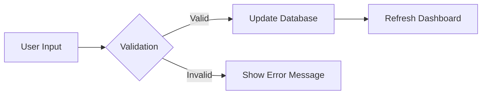

# Stage 2: System Analysis

## 1. System Flowchart

## 2. Key Use Cases

### UC-01: [Use Case Name]

* **Primary Actor:** User
* **Main Flow:**
1. [Step 1]
2. [Step 2]

## 3. Data Dictionary

| Variable Name | Data Type | Description |
| --- | --- | --- |
| `task_id` | UUID | Unique ID for every task |
| `is_active` | Boolean | Is the task visible or archived? |

## 4. Constraints & Assumptions

* The system assumes the user has a modern web browser.
* The system will only support English in Version 1.0.